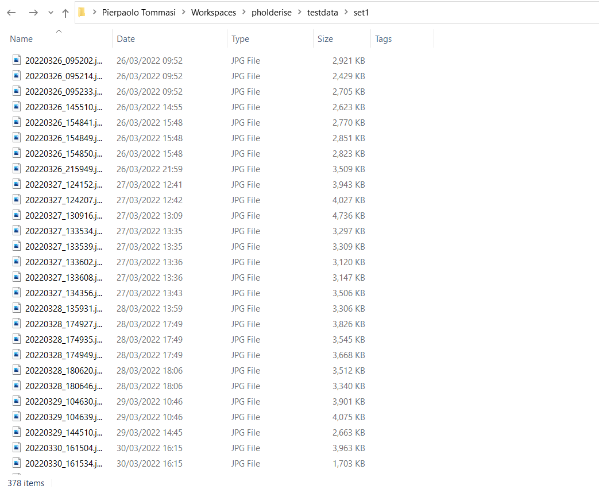
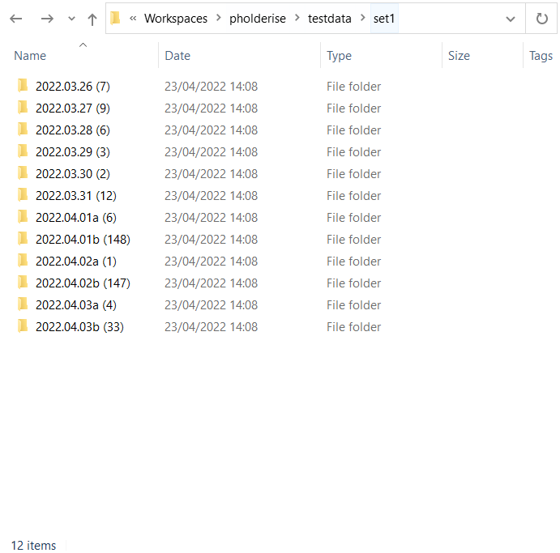
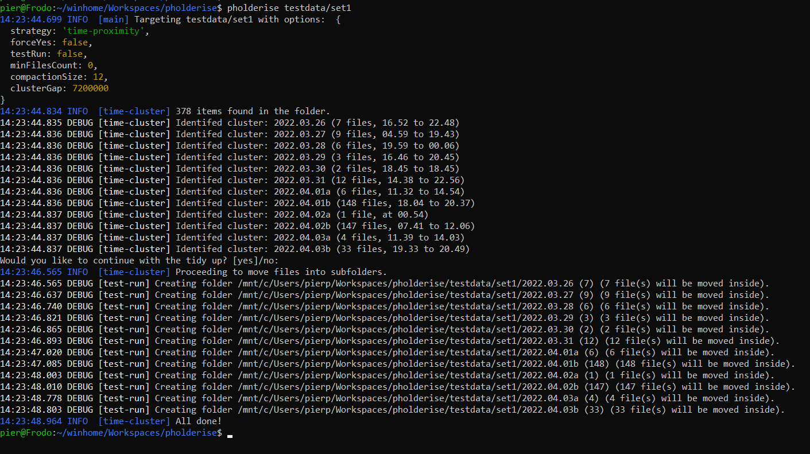
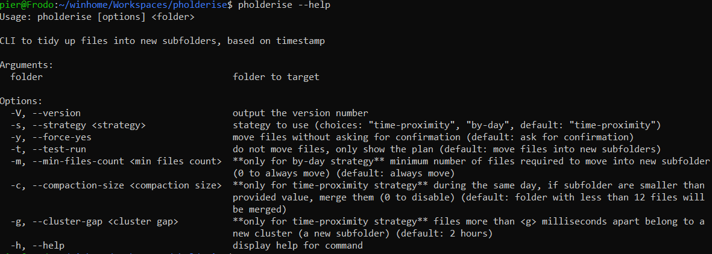

**** WORK IN PROGRESS ****

# Pholderise

A basic command line tool to scatter multiple files (e.g. photos) under new subfolders based on their modification date.

## Getting started

Pholderise allows you to tidy up a folder full of files (e.g. DCIM folder, or a backup of all your photos) into more manageable subfolders. Main use case is to make a first pass on all the photos dumped into a folder (a backup on a Synology NAS, the DCIM folder in Android, etc...), for an easier organisation later on.

As a driving example, imagine you have a DCIM folder with ~40 photos / videos taken during the course of a few months. Pholderise would cluster all these photos into days (and a day could be further broken down into multiple subfolders, if needed) for an easier management.

Here an example target folder with all the photos / videos dumped in it:
 

And here is the result after pholderising it:
 

## Usage

In the simplest form, after installing it globally (`npm install -g pholderise`), just run `pholderise <target_folder>`:

Currently pholderise supports two strategies to move files around:
 - Using the time proximity strategy (default option) all the files that are close in time (e.g. photos take within two hours) are clustered together.
    - Example: Let's say that on the 02/02/2022 you had a very busy day with lots of photos taken:
        - In the morning you went for a long hike, taking 23 photos
        - Then you met with friends for lunch, taking 5 photos
        - At night you went for a concert, taking 42 photos
      
      Time proximity will create three different subfolders: `2022.02.02a (23)`, `2022.02.02b (5)`, `2022.02.02a (41)`, that you can later rename to your liking.
    - The time that photos have to be further apart in order to belong to the same cluster can be defined using the `cluster-gap` parameter.
    - If this strategy would create too many folders, you can merge the small ones together using the `compaction-size` parameter.
        - Example: in the morning you went shopping, and took a couple of photos. During the day you kept taking photos here and there. In the afternoon you go to a football match and take plenty of pictures. You would end up with a lot of scattered folders for the morning, and a big folder for the afternoon match. Compaction size would merge all these small _consecutive_ folders into a bigger one (note that only merges consecutive folders, in order to keep the timeline of events).
 - The "by day" strategy is the more naive one, it just moves all the files into a folder created with the day timestamp. Since some days might be less eventful than others, the `min-files-count` option allows to avoid moving photos around when there aren't too many.

Running `pholderise -h` or `pholderise --help` will show all the options just described:

And here is another recap of what they do:
| Option name:                                                        | Parameters:           | Description:                                                                                                                                                                                                                 |
|---------------------------------------------------------------------|-----------------------|------------------------------------------------------------------------------------------------------------------------------------------------------------------------------------------------------------------------------|
| version                                                             | -V, --version         | Output the version number                                                                                                                                                                                                    |
| help                                                                | -h, --help            | Show the help menu                                                                                                                                                                                                           |
| avoid confirmation                                                  | -y, --force-yes       | Pholderise will ask user for confirmation _after_ showing a summary of the files and _before_ applying change to the file system. Use this option to skip the question (e.g. for automated script with no user interaction). |
| test run                                                            | -t, --test-run        | Mostly for debugging. It will only show which new  subfolders would be created (filesystem won't be modified).                                                                                                                                     |
| strategy                                                            | -s, --strategy        | Pholderise could cluster files together based on their "time-proximity" (e.g. if within a given range) or simply "by-day". Time proximity is the default option.                                                             |
| minimum files count _(only applicable to "by-day" strategy)_     | -m, --min-files-count | When clustering by day, you might want to avoid creating folders too small (e.g. only with 3 files). This option allows to define how many files a folder should contain.                                                    |
| compaction size _(only applicable to "time-proximity" strategy)_ | -c, --compaction-size | When clustering by proximity, you might want to merge together folders that are too small. Compaction size allows to define a threshold for _consecutive_ small folders to be merged together.                                |
| cluster gap _(only applicable to "time-proximity" strategy)_     | -g, --cluster-gap     | Files "cluster-gap" or lower milliseconds apart are clustered together. Default value is two hours.                                                                                                                          |

## Installation

Pholderise can be installed directly from npm (using the global directive) or used on a pre-configured docker image (for an environment where you don't have direct access to the terminal, like a NAS). For more hardcore users, the source code is available too.

### From NPM

Pholderise can be used directly on the command line using the npm global installer:
`npm install -g pholderise`

### Using Docker

For some environments (e.g. a NAS device), you can opt to use the `pierpytom/pholderise` image, which comes with the `pholderise` command already available (just mount the folder you want to tidy up as a rw volume).

### From Source Code

Pholderise is written in TypeScript, therefore a compilation pass must be done first (handled by `npm start`).

Please note that when using npm, arguments for the script must be passed using `--` syntax, e.g.: `npm start -- imagefolder -s by-day -t`.

### Synology NAS

I use Docker on my Synology NAS, some screenshots will follow once the image is online.

## Future Works

To understand what I might do in the future, it's useful to understand my pipeline, since my goal it's just to save myself some time: I'm old school and manually sort all my photos mostly by day, which I regularly backup on my NAS which then indexes and exposes them through Synology Photos. In reality, this sorting doesn't happen regularly but rather every few months, during which I might gather thousands of photos both from my Reflex and my mobile... As part of this process, I also rename the folder based on where the photos were taken (e.g. "2022.02.02 Grotta della Poesia, Roca").

Some future work:
 - Testing. 🤦‍♂️
 - Investigating online services (e.g. Google Map APIs) in order to have a provisionary label to help me with the renaming of the folder
 - Logging and output are quite terrible, and I didn't consider any integration with any other tool. Depending on how I end up using it, I might have a look at those (e.g. at the moment it cannot be piped in bash).
 - A cron job might be a solution to have photo sorted periodically, although it's not guaranteed that all the photos have been uploaded (e.g. my mobile is on WiFi only for 30 mins, half of the new photos are uploaded, pholderise has no status and new photo are sorted ex novo).
 - I don't know if it's worth looking into making it into an app. Being TypeScript I could have a look at Electron. What can be improved is the clustering of photos, an Android app (or desktop app) could be used to split images into folders allowing the user to customise the time window manually. Given the simplicity of the core algorithm, rewriting from scratch might be easier.

## Some development notes

Some random notes:
 - it's a two stages build, just to reduce the size taken mostly by the node dev modules.
 - because it's a rootless container, the `--chown=1001:1001` flag is needed during the copy.
 - after the `npm install -g`, it seems that pholderise it is installed correctly (even double checking with `npm list -g`), but bash won't find it. Looking at `npm config get prefix`, the prefix folder is not in $PATH, therefore it needs to be updated, this is why there is a _~/.bashrc_ file with an exported libraries.
 - I personally don't like the _~/.bashrc_ file, but since _/bin/bash_ is a non-login shell, the drop-ins under _/etc/profile.d_ are ignored (and I really don't want to edit _/etc/bashrc_).
 - Updating the base OS libraries costs around ~100MB on the final image (on top of the already taken ~200MB). At the moment it's not much of a security risk, since it just ran in my private network.

Some links I used:
 - More info about the [NodeJS 16 Red Hat base image](https://catalog.redhat.com/software/containers/rhel8/nodejs-16-minimal/615aefc7c739c0a4123a87e2) and its [Docker file definition](https://catalog.redhat.com/software/containers/ubi8/nodejs-16/615aee9fc739c0a4123a87e1?container-tabs=dockerfile)
 - I followed some of [RedHat best practices](https://developers.redhat.com/articles/2021/11/11/best-practices-building-images-pass-red-hat-container-certification#best_practice__2__make_the_image_run_as_a_non_root_usern), I think it's an useful read regardless
  - StackOverflow gave me good hints to solve the [npm global install issue](https://stackoverflow.com/questions/38269648/global-node-packages-installed-to-wrong-directory)
 - Altough I ended up not updating the dnf packages, I found [a useful trick to limit the installed packages size on update](https://stackoverflow.com/questions/61662403/microdnf-update-command-installs-new-packages-instead-of-just-updating-existing)
 - I'm not fully sold on this, but [the tail command seems a common way to have a container running indefinitely](https://stackoverflow.com/questions/30209776/docker-container-will-automatically-stop-after-docker-run-d), I just modified the solution a bit to allow `docker run /bin/bash` on the container.

And finally some docker commands if you want to play with it directly:
 - Enter the UBI image and play with it directly, mounting the project folder under _/src_ (you can repeat the steps of the dockerfile and see what's going on):
    > `docker run -v ${PWD}:/src -it registry.access.redhat.com/ubi8/nodejs-16 /bin/bash`
 - The basic build & run:
    > `docker build -t pholderise:test .`

    > docker run -it pholderise:test /bin/bash
 - The container is rootless, this is an option to gain root access:
    > docker run -u root -it pholderise:test /bin/bash
 - If you just want to run the container una tantum, --rm will do the cleanup for you:
    > docker run -v ${PWD}:/mnt --rm -it pholderise:test /bin/bash

## Disclaimer

Software is provided "as-is", and please make sure you are targeting the correct folder (I might have pholderised my source folder a few too many times... that's why I put the `-y` option...).